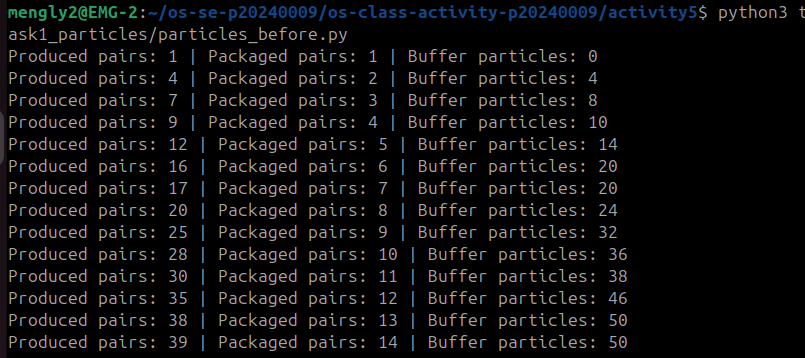
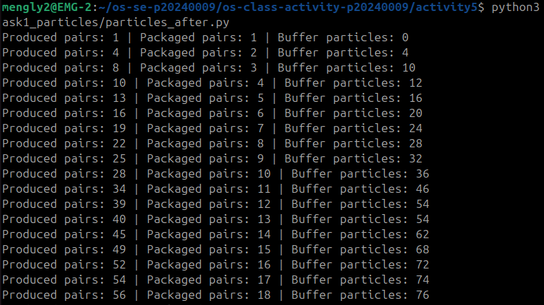
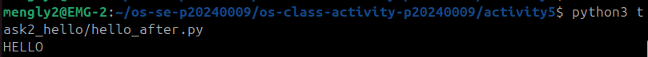

# Class Activity 5 - Semaphores

- **Student Name:** EANG MENGLY
- **Student ID:** p20240009
- **Programming Language Used:** Python

---

## Task 1A: Particle Pair Buffer Before Semaphores

- **What error or incorrect behavior appeared:** The program crashes immediately with the error message: `The packaging machine is broken`.
- **Why did this happen without semaphore protection:** The consumer thread attempted to read and drop elements from the shared list array before the producers had written items into it, causing an underflow race condition due to zero concurrency orchestration.

---

## Task 1B: Particle Pair Buffer After Semaphores

- **Number of producer machines:** 3
- **Buffer capacity:** 100 particles (50 pairs)
- **Semaphores used:** `empty_pairs` (50), `full_pairs` (0), `mutex` (1)
- **Produced pair count shown in screenshot:** [Fill this based on your terminal run output]
- **Packaged pair count shown in screenshot:** [Fill this based on your terminal run output]
- **Did any error appear during normal operation?** No. The program operates cleanly and coordinates indefinitely until interrupted by the user.

---

## Task 2A: HELLO Before Semaphores

- **Output before semaphore ordering:** Randomly sorted combinations like `OLEHL`, `LLEHO`, or `HLELO`.
- **Why this output can be wrong or unpredictable:** The operating system handles execution allocations dynamically across multiple hardware thread tracks. Without barriers or flags, whichever thread catches a CPU slice first fires out its print buffers.

---

## Task 2B: HELLO After Semaphores

- **Processes or threads used:** 3 concurrent worker threads.
- **Semaphores used:** `start_h` (1), `after_e` (0), `after_l1` (0), `after_l2` (0)
- **Final output:** `HELLO`

---

## Questions

1. **In Task 1, why does a producer need to wait before adding a pair to the buffer?** To prevent memory allocation buffer overflows. If the array hits its 100 particle limit, a producer must sleep until spaces are freed up by the consumer.
   
2. **In Task 1, why does the consumer need to wait before removing a pair from the buffer?** To prevent a runtime underflow error. If there are fewer than 2 items in the storage structure, the consumer must yield and wait for a full pair to be logged.

3. **Which semaphore protects the critical section in your particle buffer program?** The binary semaphore `mutex`. It guarantees that only one thread can mutate or alter the raw array structure at a time.

4. **How does your program verify that `P1` and `P2` belong to the same pair?** Each item is pushed into the buffer as a formatted string string: `M<MachineID>-<PairID>-P1/P2`. The consumer splits this text tag using dashes (`-`) and checks that both particles share an identical Machine ID and Pair ID.

5. **In Task 2, why can the program print letters in the wrong order without semaphores?** Because thread execution timing is non-deterministic. Without inter-thread synchronization constraints, the execution sequence depends completely on the OS kernel scheduler.

6. **Which semaphore or synchronization step forces `H` to print before `E`, `L`, `L`, and `O`?** The `start_h` semaphore initialization state. Since it begins at `1`, it is the only lock that allows immediate passage. The remaining synchronization semaphores are initialized to `0` and remain blocked until sequentially unlocked.

7. **What could cause deadlock in either of your simulations?** Acquiring semaphores in the wrong order. For example, if a producer acquires the `mutex` **before** checking `empty_pairs.acquire()`, it could lock the buffer and go to sleep waiting for empty space. However, since it holds the mutex, the packager can never enter the buffer to remove elements, locking the system forever.

---

## Reflection

*These simulations demonstrate the two primary use cases of Semaphores: Mutual Exclusion (protecting shared data structures from simultaneous mutation) and Event Sequencing/Signaling (forcing separate, concurrent processes to execute tasks in a precise chronological pipeline).*
