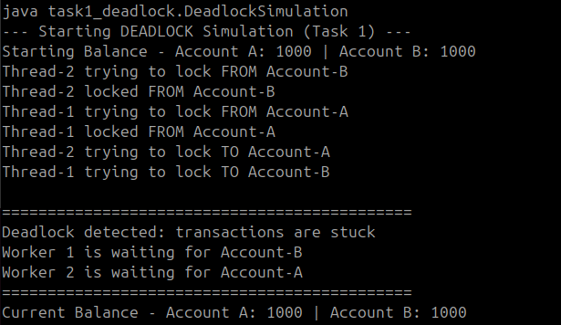
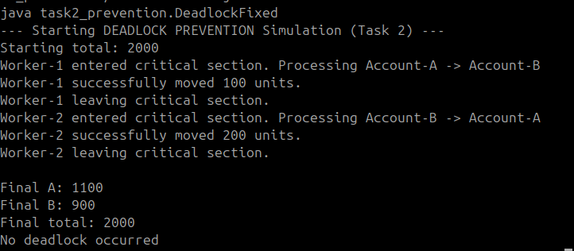

# Class Activity 6 - Deadlock Simulation

- **Student Name:** Eang Mengly
- **Student ID:** p20240009
- **Programming Language Used:** Java

---

## Task 1: Deadlock Version

- **Shared resources:** `Account-A` and `Account-B` (specifically their internal tracking `Semaphore lock` instances).
- **Transaction 1:** Worker 1 (`Thread-1`) locking Account-A, then attempting to lock Account-B to transfer 100.
- **Transaction 2:** Worker 2 (`Thread-2`) locking Account-B, then attempting to lock Account-A to transfer 200.
- **Deadlock message shown:** `Deadlock detected: transactions are stuck`
- **Explanation of why the program got stuck:** `Thread-1` successfully locked Account-A and then slept briefly. Simultaneously, `Thread-2` locked Account-B and slept briefly. When they woke up, `Thread-1` indefinitely blocked trying to acquire Account-B's lock (held by Thread-2), while `Thread-2` indefinitely blocked trying to acquire Account-A's lock (held by Thread-1). Neither could proceed, causing a permanent freeze.

---

## Task 2: Deadlock Prevention Version

- **Prevention strategy used:** Coarse-Grained Mutual Exclusion via a Global System Mutex Barrier (Mutual Exclusion Restructuring).
- **Semaphore mutex initial value:** 1
- **Starting total:** 2000
- **Final total:** 2000
- **Did both transfers complete?** Yes.
- **Why no deadlock occurred:** The inclusion of a singular master `mutex` semaphore guarantees that only one transaction thread can enter the processing block at a time. Because a worker thread must acquire the system-wide mutex before attempting to lock or touch any bank accounts, it prevents a second thread from splitting the resources midway. This systematically destroys the **Hold-and-Wait** and **Circular Wait** deadlock conditions.

---

## Questions

1. **What are the two shared resources in your bank transaction simulation?**
   > The two shared resources are `Account-A` and `Account-B` (guarded by their respective semaphore lock instances).

2. **Which line or section of your Task 1 program creates hold-and-wait?**
   > The segment in `Transfer.transfer()` where a thread keeps its hold on the first account resource (`from.lock.acquire()`) and then immediately invokes `to.lock.acquire()` to wait for the second resource without releasing the first.

3. **How does Task 1 create circular wait?**
   `> Thread-1` holds the lock for Account-A and is waiting for Account-B. Simultaneously, `Thread-2` holds the lock for Account-B and is waiting for Account-A. This forms a closed loop of dependency dependency graph ($Thread-1 \rightarrow Account-B \rightarrow Thread-2 \rightarrow Account-A \rightarrow Thread-1$).

4. **Why does the Task 1 program need a watchdog or timeout?**
   > Because operating systems do not automatically resolve code deadlocks. Without an active watchdog observer thread monitoring execution time and forcing an exit, the program would hang silently forever, wasting CPU tracking frames and system resource threads.

5. **How does the single semaphore mutex prevent deadlock in Task 2?**
   > It forces serialization. By forcing each worker thread to get clearance from the global `mutex` before initiating any account balance manipulation, it prevents multiple transactions from interlacing their allocations and holding partial resources simultaneously.

6. **Which of the four deadlock conditions does your Task 2 solution remove or avoid?**
   > It eliminates **Hold-and-Wait** (threads no longer hold a resource while waiting for another to be freed) and breaks **Circular Wait** (resources cannot be cross-locked into an interleaved circle dependency).

7. **Why must the final total bank balance remain unchanged after both transfers?**
   > Due to the law of conservation of money in isolated transactions. Because funds are simply moved between accounts within a closed system, any modification to the total sum would indicate a critical race condition, data corruption, or electronic duplication/loss of funds.

---

## Reflection

This activity demonstrates that deadlocks occur when concurrent workers attempt to claim individual pieces of a multi-resource set in an uncoordinated or opposite sequence. In production applications like transactional banking databases or microservices, using global mutex locks provides a simple and secure solution. However, because it forces operations to run one after another, it can slow down performance. For high-volume systems, using alternative strategies like strict resource lock ordering or non-blocking lock attempts (`tryAcquire` with timeouts) allows transactions to run safely in parallel without freezing.
